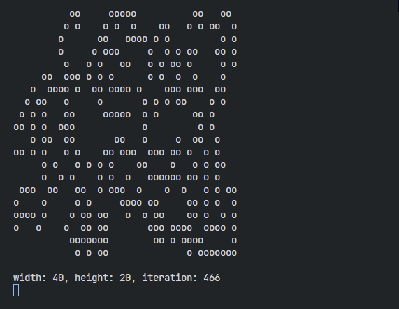

# Game of Life
John Conway's Game of Life, written in C

Demonstration
:-----------------------------:

## Setup and Usage
After cloning the repository, build the binary using `make`.

Run the simulation using `game-of-life <width> <height>`.
